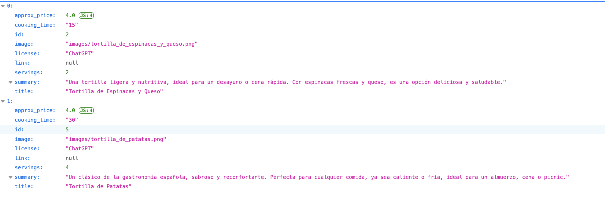
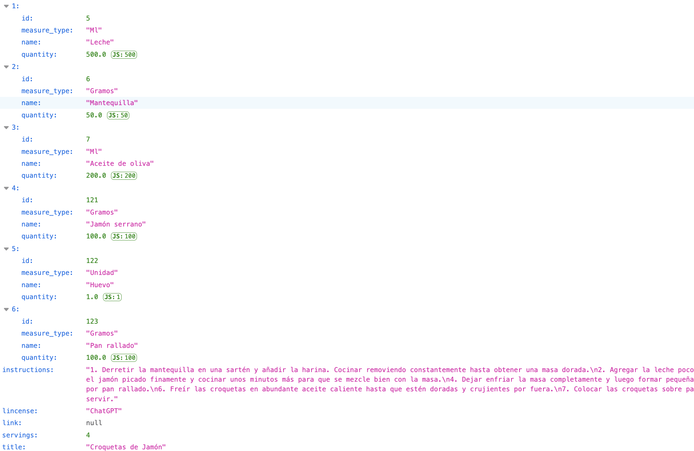

# recetasAPI 🥘
**Recipes API: API for managing Spanish recipes with filters and ingredient details.**

## Technologies Used

- **Python**: The main programming language used.
- **Flask**: The framework used to build the  API.
- **SQLite3**: The database used to store recipe data in a lightweight, serverless format.
- **Git**: Version control system used for managing code and collaboration.
- **Virtualenv** (if used): Tool to create isolated Python environments.

## The database
The database started with the following relational diagram:

![Entity-Relationship Diagram][image-1]

Although I plan to make some amendments in the future to address emerging needs, this diagram represents the foundation of my project. The database is organized into multiple tables, with the Recipes table as the main one, containing essential information about each recipe.

In addition to the Recipes table, the database includes the following tables to provide comprehensive and detailed information:

- Ingredients table: Stores the ingredients used in each recipe.
- Diet Type table: Specifies dietary categories 
- Food Group table: Classifies ingredients into nutritional groups.
- Difficulty table:  The level of complexity required to prepare each recipe.
- Dish Type table: Based on the type of dish.

These additional tables are related to the Recipes table, allowing for a well-organized and easily expandable structure that enhances the flexibility of the application.

There are also two files in the database folder.

1. **script.py** -\> this script is responsible for creating the database along with all the necessary tables.
When executed, it will generate the following tables:

- recipes
- recipes\_ingredients
- ingredients
- measure\_type
- recipes\_diet\_type
- diet\_type
- recipes\_food\_groups
- food\_groups
- difficulty                 
- dish\_type

2. **seeds.py** -\> this script is used to populate the database with initial data to test and experiment with the API.
It will add 19 classic Spanish recipes along with their ingredients and complementary information in the related tables.
This makes it easy to explore and interact with the API without having to manually add data.
  
**Quick Start**

To quickly set up the database and load the initial recipes, execute the following commands:

python3 script.py

python3 seeds.py

## The API

This API allows you to manage and search for recipes stored in the database, offering flexible filtering options to get precise results based on your criteria. At the moment, it has two main endpoints:
1.   General recipe search: Retrieves a list of recipes that match the specified filters.
2.   Recipe details: Shows detailed information about a specific recipe using its ID.

The API is built with Flask, following best practices for project structure and leveraging SQLite3 for data management. It is designed to adhere to RESTful API principles as much as possible, ensuring clear and consistent endpoint naming, proper use of HTTP methods, and stateless interactions. This not only makes the API intuitive and easy to use but also aligns with modern standards for maintainability and scalability.

Project Structure
- main.py: The entry point that starts and manages the Flask server.
- db.py: Handles the connection to the SQLite database.
- models/: Contains Python functions that interact directly with the database.
- routes/: Defines the API endpoints and processes incoming requests by interacting with models.py to fetch the needed data.

### How to Use the API

1. Searching for Recipes

**GET http://localhost:port/recipes**

This endpoint lets you search for recipes stored in the database using a variety of filters. The **keyword** filter is required, while the others are optional and can be combined as needed.

Available Filters

- **keyword** (required): Filters recipes containing the specified text in the title, summary, or instructions.
  
	Example:
		- http://localhost:port/recipes?keyword=tortilla
  
- **ingredients** (*optional*): Filters recipes that include one or more specified ingredients.
  
	Example:
		- http://localhost:port/recipes?keyword=tortilla&ingredients=cebolla
  
		- http://localhost:port/recipes?keyword=tortilla&ingredients=huevo&ingredients=patatas

- **diet_type** (*optional*): Filters recipes according to dietary preferences, which can be combined with other filters.

  	Example:
  		- http://localhost:port/recipes?keyword=tortilla&diet_type=vegetariana
  
  		- http://localhost:port/recipes?keyword=pasta&diet_type=sin+lactosa&diet_type=vegana
  
- **food_groups** (*optional*): Filters by food groups, like “carne”, "Verduras", or “Pasteles”. You can specify more than one.

  	Example:
  		- http://localhost:port/recipeskeyword=tortilla&food_groups=carne&food_groups=patatas
  
  		- http://localhost:port/recipes?keyword=tortilla&diet_type=vegetariana&food_groups=tapas+calientes
  
- **difficulty** (*optional*, **single-use**): Filters recipes by difficulty level (fácil", "medio", "difícil", "profesional”).

  	Example:
		- http://localhost:port/recipes?keyword=tomate&difficulty=medio
  
- **dish_type** (*optional*, **single-use**): Specifies the type of dish, like "starter", "main course", or "dessert".

  	Example:
		- http://localhost:port/recipes?keyword=tomate&dish_type=primer+plato  
	  

###Example Response (Search)

This is an example of the JSON response you can get by filtering as shown above.

2. Searching for an accurate recipe:
   
**GET http://localhost:port/recipes/id/{integer}**

This endpoint returns detailed information about a specific recipe, identified by its ID.

###Usage Examples

http://localhost:port/recipes/id/4

http://localhost:port/recipes/id/18

###Example Response

This is an example of the JSON response you can get by filtering as shown above.

Below are the filters you can use in your searches using the API

**ingredients**

Harina
Azúcar
Sal
Huevos
Leche
Mantequilla
Aceite de oliva
Levadura
Vainilla
Chocolate
Fresas
Manzanas
Zanahorias
Papas
Cebollas
Tomates
Pollo
Carne molida
Queso
Orégano
Pimienta
Canela
Albahaca
Ajo
Limón
Arroz
Frijoles
Pan
Crema
Champiñones
Espinacas
Perejil
Chile
Apio
Pimientos
Miel
Jengibre
Cilantro
Mostaza
Ketchup
Salsa de soya
Vinagre
Caldo de pollo
Pescado
Camarones
Lentejas
Yogur
Almendras
Nueces
Pasas
Maíz
Avena
Pan integral
Aguacate

**diet_type**

Vegetariana
Vegana
Sin gluten
Sin lactosa
Sin trigo
Baja en carbohidratos
Keto (Cetogénica)
Mediterránea
Dieta DASH
Dieta nórdica
Sin azúcar
Baja en sodio
Alta en proteínas
Baja en grasas
Dieta macrobiótica
Dieta carnívora
Sin soja
Sin huevo
Low FODMAP
Whole30
Dieta baja en colesterol
Dieta rica en fibra
Dieta hiperprotéica
Dieta para diabéticos
Dieta DASH vegetariana
Dieta rica en calcio
Dieta sin cítricos
Dieta sin fructosa

**difficulty**

Fácil
Medio
Difícil
Profesional

**dish_type**

Entrante
Plato principal
Acompañamientos
Postre
Bebida

**food_groups**

Tapas Calientes
Tapas frías
Canapé
Hojaldres
Empanadillas
Empanadas
Crudités
Carpaccio
Salsas
Encurtidos
Carnes
Aves
Ensaladas
Verduras
Purés
Patatas
Panes
Hojaldres
Pescados
Tartas
Pasteles
Helados
Sorbetes
Flanes y puddings
Galletas
Bizcochos
Frutas
Soufflés
Mariscos
Cócteles
Bebidas refrescantes
Batidos y licuados
Pasta
Arroces
Guisos y potajes
Parrilla o Barbacoa
Platos al horno
Frituras
Platos étnicos

[image-1]:	database/images/Entity-Relationship%20Diagram.png
